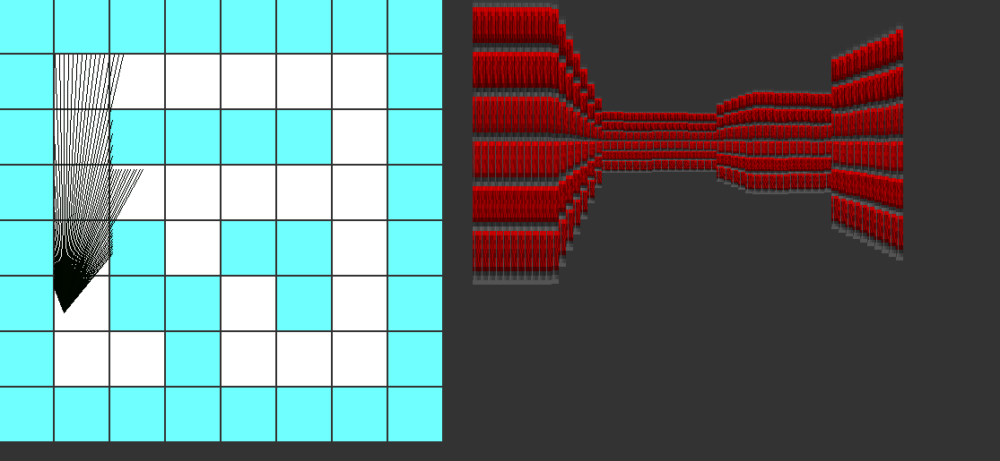

# 3D Maze Game project



## Description
This project aims to create a 3D Maze game using C, SDL2, and Raycasting.

## Directory Structure

|Directory or file name | Description |
|-----------------------|-------------|
| [dependencies](dependencies) | store all header files |
| [src](src) | store all source code |
| [README](README.md)            | the main README of the project

## Requirements
You need to have SDL2 and SDL2_image to be able to run this code
## Building and Compilation
To compile the project, use the following GCC flags:
```
gcc -Wall -Werror -Wextra -pedantic ./src/*.c -lm -o maze `sdl2-config --cflags` `sdl2-config --libs` -lSDL2_image
```

## Usage
- Run the executable to start the 3D Maze game.
```
./maze
```

## Game key

|Key | Action |
|-----------------------|-------------|
| K | Go forward |
| J | Go backward |
| H | Rotate the camera to the left |
| L | Rotate the camera to the right |

## Demo
Here a YouTube demo of the [game](https://youtu.be/tLM9Ln5v-bE)

## Style Guide
Follow the Betty styling guidelines for maintaining a consistent coding style.

## License
This project is licensed under the [MIT License](LICENSE).

